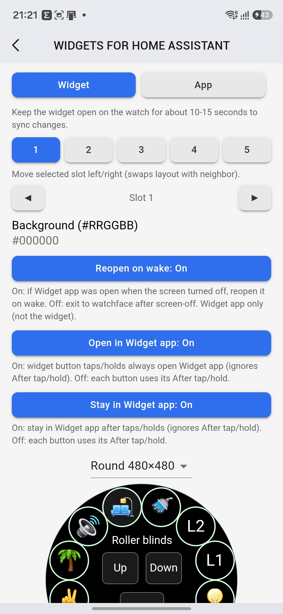
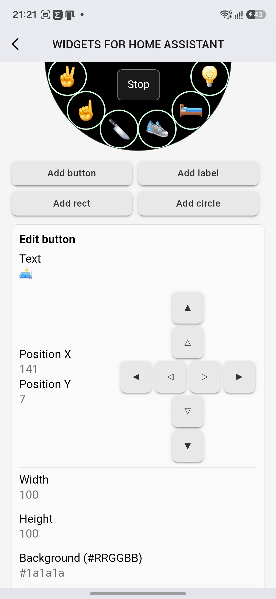
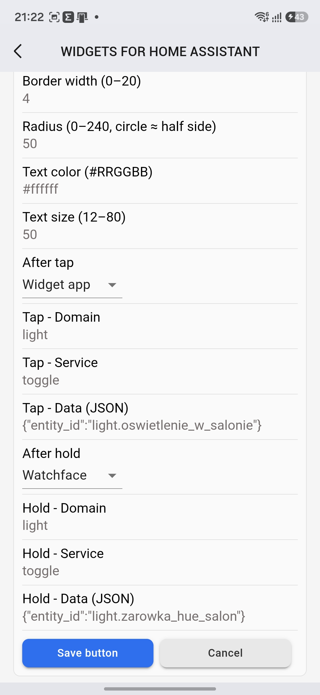
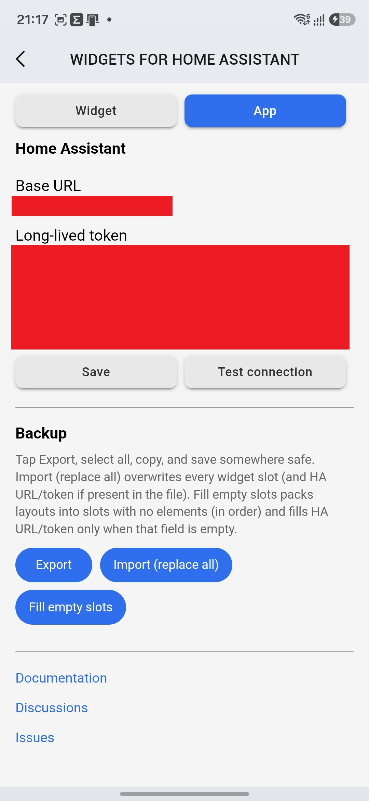
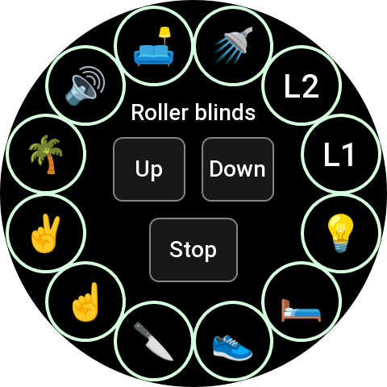
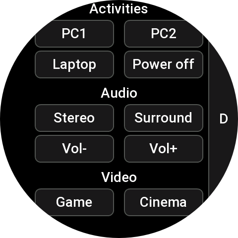
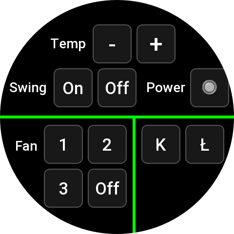
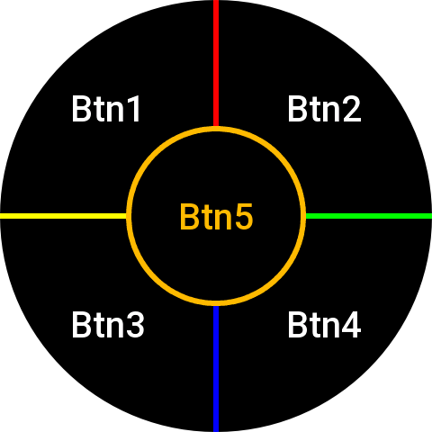

# Widgets for Home Assistant

Build custom **widgets** for Amazfit / Zepp OS that call Home Assistant services. Edit layouts on the phone; run actions on the watch.

This public repo is **docs + community only** (Issues, Discussions, example configs). App source stays private.

Unofficial — not affiliated with Nabu Casa / Home Assistant / Zepp Health.

## Requirements

- Watch: **Zepp OS 2.0+**
- Phone: Zepp app, watch paired
- Home Assistant + **long-lived access token**

## Quick start

1. Install the app from the Zepp store.
2. Zepp → if you have more than one watch, select yours → **Device application settings** → **More** → **Widgets for Home Assistant**.
3. **App** tab: HA Base URL + long-lived token → **Test connection**.
4. **Widget** tab: pick slot **1…5**, add elements → layouts save to phone storage.
5. Zepp → if you have more than one watch, select yours → **Device settings** → **Widgets** → add **HA Widget N** → **Save**.
6. Keep the widget (or Widget app) open **~10–15 s** so the watch pulls the layout over Bluetooth. A widget syncs **that slot only**; Widget app syncs **all slots**.

Credentials stay on the phone. The watch only stores layout JSON.

## Phone (Settings)

Zepp → **Device application settings** → **More** → **Widgets for Home Assistant**.

### Widget tab

- **Slots 1–5** — each maps to watch widget **HA Widget 1…5**.
- **◀ ▶** — swap the selected slot with its neighbor (layouts + flags move together).
- **Background** — widget fill color.
- **Flags (per slot)**
  - **Reopen on wake** — if Widget app was open at screen-off, reopen it on wake (Widget app only).
  - **Open in Widget app** — taps/holds from the widget always open Widget app (ignores After tap/hold).
  - **Stay in Widget app** — after taps/holds in Widget app, stay there (ignores After tap/hold).
- **Elements:** button, label, fill/stroke rect, circle.
- **Button:** tap + optional hold → HA domain/service/data JSON; **After tap/hold** = Watchface or Widget app.
- **Free version:** tap/hold only for the **first 2 buttons on slot 1**. Other buttons stay visual; Settings shows a red notice instead of action fields.
- **Buy full version:** top of Settings → **Buy** → enter the code at [kzl.io/code](https://kzl.io/code).
- **Clear slot** — empties the current slot (with confirm).

 

### App tab

- HA URL + token + test.
- **Export** — full backup JSON (HA + all slots).
- **Import (replace all)** — overwrites every slot (and HA fields if present in the file).
- **Fill empty slots** — packs backup layouts into empty slots only, in order (e.g. free 1,3,5 ← backup layouts 1,2,3; extras skipped). Also fills HA URL/token only when that field is empty.

## Watch

Example layouts (import from [Discussions](https://github.com/michalowskil/widgets-for-home-assistant/discussions)):

   

### Widget (HA Widget 1…5)

- Shows cached layout; no sync spinner.
- Tap/hold button → HA action and/or Widget app (per After tap/hold + slot flags).
- Sync: while focused, pulls **this slot** from the phone after ~10 s.

**Carousel:** you can add **5** HA widgets, but the watch keeps only as many as fit next to system widgets and other apps. Long-press edit can list all five; after you leave edit — or after a reboot — the stack may show fewer or drop another app’s widget. Use **Widget app** for any slot that is not on the swipe stack.

### Widget app

Same layouts as the widgets, full screen. Swipe between slots that have elements.

Open it from:
- a widget button, if that button’s **After tap/hold** is Widget app (or the slot has **Open in Widget app** on — then every tap/hold on that widget opens Widget app)
- the watch app list (**Widgets for Home Assistant**)

Keep it open **~10–15 s** to sync **all slots**.

## Sample configs

Importable JSON backups: **[Discussions](https://github.com/michalowskil/widgets-for-home-assistant/discussions)**.

App → Fill empty slots.

## Feedback

- Bugs: [Issues](https://github.com/michalowskil/widgets-for-home-assistant/issues)
- Questions / configs: [Discussions](https://github.com/michalowskil/widgets-for-home-assistant/discussions)

Include watch model + app version when reporting bugs.

## Version

**1.0.0**
